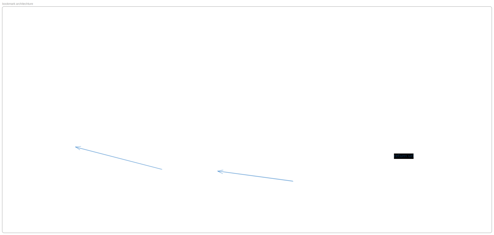

# Bookmark Deployment

A containerized bookmark management application with a microservices architecture using Docker Compose.

## Architecture




This project consists of four main services:

- **Bookmark Service**: Backend API service for bookmark management (Go application)
- **Portal**: Frontend web application for user interface
- **Redis**: In-memory data store for caching and session management
- **Nginx**: Reverse proxy server for routing and load balancing

## Prerequisites

- Docker
- Docker Compose

## Project Structure

```
.
├── docker-compose.yaml       # Docker Compose configuration
├── Makefile                  # Build and deployment commands
├── bookmark_service/         # Backend service directory
│   └── .env.example          # Environment variables for backend
└── nginx/
    └── nginx.conf            # Nginx reverse proxy configuration
```

## Configuration

### Environment Variables

The bookmark service uses the following environment variables (configured in `bookmark_service/.env`):

- `REDIS_ADDR`: Redis server address (default: `redis:6379`)
- `APP_HOST_NAME`: Application hostname (default: `localhost/api/bookmark_service`)

### Nginx Routing

The Nginx reverse proxy routes traffic as follows:

- `/` → Portal frontend (port 3000)
- `/api/bookmark_service/` → Bookmark Service backend (port 8080)

## Getting Started

### Create a .env file following the .env.example

```bash
cp ./bookmark_service/.env.example ./bookmark_service/.env

```

### Start the Application

```bash
make up
```

Or using Docker Compose directly:

```bash
docker-compose -f docker-compose.yaml up -d
```

### Stop the Application

```bash
make down
```

Or using Docker Compose directly:

```bash
docker-compose -f docker-compose.yaml down
```

## Services

### Bookmark Service

- **Image**: `haihoanguci/bookmark_service:dev`
- **Container**: `bookmark_service`
- **Dependencies**: Redis
- **Configuration**: Environment variables loaded from `bookmark_service/.env`

### Portal

- **Image**: `ebvn/bookmark-app-portal:dev`
- **Container**: `portal`
- **Dependencies**: Bookmark Service

### Redis

- **Image**: `redis:alpine`
- **Container**: `redis`
- **Purpose**: Caching and data storage

### Nginx

- **Image**: `nginx:alpine`
- **Container**: `nginx`
- **Ports**: `80:80`
- **Configuration**: Custom nginx.conf mounted from `nginx/nginx.conf`

## Accessing the Application

Once the services are running, access the application at:

- **Frontend**: http://localhost
- **Backend API**: http://localhost/api/bookmark_service/

## Development

To build and deploy the services:

1. Ensure all environment variables are properly configured in `bookmark_service/.env`
2. Run `make up` to start all services
3. The application will be available at http://localhost

## Troubleshooting

### Check Service Status

```bash
docker-compose ps
```

### View Logs

```bash
# All services
docker-compose logs -f

# Specific service
docker-compose logs -f bookmark_service
docker-compose logs -f portal
docker-compose logs -f nginx
docker-compose logs -f redis
```

### Restart Services

```bash
docker-compose restart [service_name]
```

## License

This project is part of the EBVN BE01 course.
